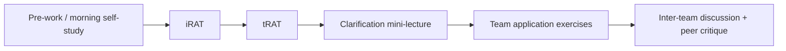

# Purpose of this document

This plan describes how to **design, build, and deliver** two days of sessions on principles and workflows for reproducible science as part of the doctoral course [K9F5740 *Quality Assurance in Research From a Global Perspective*](https://doctoralcourses.application.ki.se/fubasextern/info?kurs=K9F5740).

It is a working plan for a **small teaching team (four people)** building the first offering in **under two weeks**: what to align to, which resources to reuse, which KI tools to use, how AI enters the workflow, and a short must-ship backlog.

Project-wide design and tooling choices are recorded in [`DECISIONS.md`](../DECISIONS.md).

## Shared endpoint (success criterion)

By the end of the two days, each student (or team) can:

> Create a **project folder structure** and **documentation** — independent of study methodology — so that they or someone else can return within **five years** and understand what was done and which decisions were made.

This endpoint is the constructive-alignment anchor for session ILOs, self-study tasks, TBL application exercises, and any formative checks.

# Course context and outcome alignment

## Host course snapshot

| Item | Detail |
|------|--------|
| Course | K9F5740 Quality Assurance in Research From a Global Perspective (3 HEC) |
| Department | Global Public Health |
| Study period (HT 2026) | 2026-09-21 – 2026-10-02 |
| Course forms of teaching | e-(self)learning / flipped classroom; group work; presentations; discussion |
| Course assessment | ~2000-word **data collection and management plan**, presented and discussed |
| Prerequisites | GDPR + documentation/handling of research data (KI doctoral introduction) |

These sessions occupy **two consecutive days** (Tuesday–Wednesday):

| Block | Time | Mode |
|-------|------|------|
| Morning | 09:00–12:00 | Self-study (guided) |
| Afternoon | 13:00–16:00 | In-class (Team-Based Learning) |

## Session ILOs (proposed)

At the end of these sessions, the student is expected to be able to:

1. **Use** version control (or an equivalent decision log) to track, organise, and document changes in a research project.
2. **Structure** a reproducible research workflow, including a durable folder layout and documented analytical / data-processing decisions.
3. **Collaborate** on code and research materials through an online repository (or shared documentation space) following open and reproducible science principles, at a level appropriate to the project’s sensitivity.
4. **Assess** ethical and practical implications of open research practices and reproducible workflows (what can be shared, what must stay protected, and how documentation supports accountability).
5. **Use generative AI tools responsibly** (preferring KI-supported tools) to draft folder structures, README content, decision logs, and documentation — while critically verifying outputs and recording how AI was used.

## Mapping: session ILOs ↔ relevant K9F5740 course ILOs

Not every course ILO is in scope. The table below marks **relevance** and the **contribution** of these sessions.

| K9F5740 ILO (from syllabus) | Domain | Relevance | How these sessions contribute |
|-----------------------------|--------|-----------|-------------------------------|
| Understand Helsinki Declaration, GCP, GDPR, and key ethical milestones | Knowledge | Contextual | Ethical framing for what *must* be documented and what must *not* be put in public repos or AI prompts |
| Contrast collaboration / data-sharing agreements, MoUs, ALLEA Code of Conduct, Swedish/EU/international rules | Knowledge | Supporting | Documentation of agreements, roles, and data-sharing decisions in project docs / DMP excerpts |
| **Appreciate and justify procedures to collect and document data throughout all stages** (safety, quality, storage, transfer) | Knowledge | **Core** | Folder structure, README, decision log, data dictionary stubs, storage notes — the “5-year future self” test |
| Appreciate responsibilities of investigator, team, sponsor during data collection | Skills | Supporting | Roles section in project documentation; team TBL exercise on who owns which artefacts |
| **Develop protocols and comprehensive data management plans**, risk–benefit and project risk assessments | Skills | **Core** | Practical skeleton that feeds the course’s DMP examination (structure, documentation, quality, storage) |
| Develop data collection tools / question drafting | Skills | Low | Out of scope except documenting *where* instruments and versions live |
| Summarise management aspects for ethical, safety, and collaboration standards | Skills | Supporting | Project management via repo hygiene, issue/decision tracking, and handover docs |
| **Create data quality assurance plans** including consent, data safety, and **research documentation** | Skills | **Core** | Documentation conventions, naming, versioning, separation of raw vs derived data |
| **Judge project proposals and research documentation** re: data quality, safety, ethics, inclusion | Judgement | **Core** | Peer critique of another team’s folder + docs (TBL application) |
| Define and assess challenges, risks, and ethical concerns | Judgement | Supporting | Case-based risks of “undocumented projects,” AI leakage of personal data, premature open sharing |

### Alignment to the course examination

The course examines a **data collection and management plan**. These sessions should explicitly help students produce reusable sections for that plan:

- Description of data and file organisation
- Documentation and data quality practices
- Storage, backup, and transfer notes
- Legal/ethical constraints on sharing
- Responsibilities and resources
- Long-term interpretability (the 5-year criterion)

**Recommendation:** provide a short mapping handout: “Where today’s artefacts plug into your DMP.”

# Pedagogical approach

## KI pedagogical policy (design principles)

Sessions should enact KI’s three pedagogical perspectives ([KI Pedagogical policy](https://staff.ki.se/education-support/organisation-of-higher-education-at-ki/kis-pedagogical-policy)):

| Perspective | Implication for these sessions |
|-------------|--------------------------------|
| **Student-centred and active learning** | Teachers facilitate; students build *their* project structure. Minimal lecturing; maximum doing and peer teaching. |
| **Scholarship of teaching and learning** | Collect feedback after each afternoon; revise materials between offerings; document what worked. |
| **Psychological safety** | Normalise incomplete projects and “messy first drafts.” Frame AI mistakes and Git confusion as expected learning, not failure. |

Constructive alignment (Biggs): **ILOs → learning activities → assessment evidence** must stay coherent. The visible evidence here is the folder + documentation package (and reflection on AI use), which also supports the course DMP exam.

## Team-Based Learning (TBL)

Intended model for afternoon blocks, consistent with KI practice and the course’s flipped design:

| TBL element | Day 1 focus | Day 2 focus |
|-------------|-------------|-------------|
| Pre-work | Why structure & documentation matter; KI rules; read Good Enough Practices; inspect example repos | Git/GitHub or documentation alternative; AI-assisted drafting norms; prepare own project materials |
| iRAT / tRAT | Concepts: raw vs derived; README; decision log; FAIR vs open; what belongs in ELN vs project folder | Versioning; collaboration; AI disclosure; ethical sharing boundaries |
| Application | Teams design a folder + README for a shared vignette case | Teams finalise *their* project package; peer review against the 5-year rubric |
| Closure | Gallery walk; common pitfalls | Handover checklist; link artefacts to DMP exam |

**Psychological safety note:** keep readiness tests short and conceptual; avoid punishing students who are new to Git. Offer a non-Git documentation track (decision log + dated files) that still meets the endpoint.

# Teaching with AI (required design element)

Sessions must **incorporate AI tools to reach the endpoint** (folder + documentation), not treat AI as an optional aside.

## KI stance and preferred tools

Per [KI Generative AI and Education](https://staff.ki.se/tools-and-support/ai-at-ki/generative-ai-and-education) guidance:

- Prefer **Microsoft Copilot** (available to KI staff; students via KI licensing where applicable) for teaching demos and student drafting when institutional data protection matters.
- Teach **prompting, verification, transparency, and data safety** explicitly.
- Never paste personal data, patient data, or unpublished sensitive research into consumer AI tools.
- Require students to **document AI use** (tool, purpose, prompt summary, what was kept/changed).

Related KI learning resource: [*Working with (generative) AI*](https://ki.eu-west.catalog.canvaslms.com/courses/working-with-generative-ai) (Canvas Catalog).

## AI tasks tied to the endpoint

| Student task | AI role | Human responsibility |
|--------------|---------|----------------------|
| Propose folder tree for their study type (survey / qualitative / trial / secondary data) | Generate draft structure + naming conventions | Adapt to KI storage rules; remove unsafe suggestions |
| Draft README / project overview | Draft sections from a structured prompt | Verify accuracy; add real methods, dates, roles |
| Decision log / changelog entries | Turn rough notes into clear decision records | Confirm dates, rationale, and ownership |
| Data dictionary stub | Suggest variable documentation templates | Align with actual instruments; check identifiers |
| Critique a peer package | Suggest review questions against rubric | Make the judgement; do not outsource grading ethics |
| DMP excerpt | Map folder docs → DMP headings | Ensure legal/ethical claims are correct |

**Assessment of AI literacy (formative):** short reflection (½–1 page or structured form): what AI produced, what was wrong or unsafe, what was kept, and why.

# KI tools and systems to use

## Learning delivery

| Tool | Role in these sessions | Action needed |
|------|------------------------|---------------|
| **Canvas** | Course room: self-study modules, readings, submission of artefacts, AI-use disclosure form | Create module(s); publish schedule; link chosen TBL tool |
| **TBL platform** (see below) | Digital TBL: iRAT, tRAT, application exercises | Pick the simplest path that works for *this* run; keep content tool-agnostic |
| **Padlet** (optional) | Gallery walk of folder trees / README excerpts | Create board; privacy settings appropriate to class |
| **Zoom / hybrid AV** (if hybrid) | Only if remote participants are expected | Confirm with course director |

## TBL software options (KI-supported and open source)

We will likely need **open-source TBL software** in addition to — or instead of — KI’s licensed InteDashboard, for portability, transparency, offline/partner-site delivery, and alignment with the open/reproducible ethos of these sessions.

| Option | Licence / status | TBL coverage | Fit for these sessions | Caveats |
|--------|------------------|--------------|------------------------|---------|
| **InteDashboard** ([KI](https://staff.ki.se/tools-and-support/tools/intedashboard)) | KI institutional licence; Canvas-integrated | Full TBL workflow (iRAT, tRAT, AE, peer eval) | Lowest friction *inside* KI Canvas courses | Tied to KI; less reusable for multi-country partners; not open source |
| **LAMS** ([lamsfoundation/lams](https://github.com/lamsfoundation/lams), GPL-2.0) | Mature open-source learning-design platform | Dedicated [TBL wizard](https://docs.lamsfoundation.org/tbl) (teams, iRAT, tRAT, IF-AT-style feedback, application exercises) | **Primary open-source candidate** for a full digital TBL sequence | Needs hosting (self-host or LAMS cloud); teacher onboarding; check KI IT/GDPR if student accounts leave Canvas |
| **gRATify** ([gtheilman/gRATify](https://github.com/gtheilman/gRATify)) | Open source; Docker-friendly | Strong **tRAT / gRAT** with immediate feedback and live team progress | Good lightweight piece if RATs are the bottleneck | Not a full TBL suite (pair with Canvas quizzes for iRAT + Padlet/docs for AE) |
| **OpenTBL** ([opentbl.com](http://www.opentbl.com/) / [sixthedge](https://github.com/sixthedge/opentbl)) | Marketed as open source | iRAT/tRAT, peer eval, application exercises | Conceptually close to InteDashboard | Project appears **stale** (registration closed; sparse recent maintenance) — evaluate carefully before depending on it |
| **tbltools** (R, [KopfLab/tbltools](https://github.com/KopfLab/tbltools/)) | GPL-2.0 | Generate paper/IF-AT style RAT materials from question banks | Useful for **authoring** RATs and hybrid paper+digital rooms | Not a live classroom platform |
| **Canvas-native fallback** | KI Canvas + optional Padlet | iRAT via Canvas Quiz; tRAT via group quiz / scratch-off analogue; AE via shared docs | Always available; no new infra | Weaker simultaneous reporting and IF-AT UX; more manual facilitation |

### Recommendation for this build (under two weeks)

1. **Write TBL content once** in Markdown/CSV in this repo (tool-agnostic).
2. **For the first run, prefer low friction:** InteDashboard if access is already available, otherwise **Canvas quizzes + Padlet/whiteboard** for simultaneous reporting. Do not block the offering on standing up new hosting.
3. Treat **LAMS / gRATify** as a follow-up experiment after the first offering works — unless someone on the team already has a working instance.
4. Log the choice for this run in `DECISIONS.md`.

## Research practice tools students should meet

| Tool | Role | Notes |
|------|------|-------|
| **KI ELN** | Mandatory electronic research documentation at KI | Position clearly: ELN = institutional research log; project folder/repo = analytical/organisational companion — they complement, not replace |
| **DMPonline (KI)** | Data management plans | Link session outputs to DMP sections used in the course exam |
| **Approved storage** | Active data storage per KI lists | Teach “do not use USB / personal Drive for research data” |
| **Git + GitHub** (or GitLab) | Version control & collaboration | Primary technical path; keep optional for qualitative-only students if documentation track is robust |
| **RStudio / Positron / VS Code** | Optional IDE demos | Do **not** require programming fluency; these sessions emphasise structure & documentation over coding |
| **Microsoft Copilot** | AI drafting assistant | Default institutional AI tool for demos |
| **Quarto / Markdown** | Lightweight documentation format for README and reports | Teach enough Markdown to maintain a README |

## Tools the *teaching team* needs (keep light)

| Need | Use |
|------|-----|
| Writing materials | Quarto/Markdown + Canvas pages; short slide deck only where useful |
| TBL items | Markdown/CSV in this repo → InteDashboard or Canvas quizzes |
| Examples | One good + one poor synthetic project folder |
| Shared work | This GitHub repo; decisions in `DECISIONS.md` |
| AI demo | Microsoft Copilot on the teacher machine |

# Review of available resources (reuse before reinventing)

## At KI (align, cite, avoid duplication)

| Resource | What it offers | How we use it |
|----------|----------------|---------------|
| [K8F6106 Open Science in Practice: Collaborative Research with Git](https://doctoralcourses.application.ki.se/fubasextern/info?kurs=K8F6106) ([materials](https://github.com/k-CIR/course-open-science-in-practice)) | Deep Git/GitHub/Quarto/R–Python workflow course | **Do not duplicate.** Signpost for students who need deeper skills; borrow *ideas* for folder/README examples with attribution |
| [K8F6069 Open Science and Reproducible Research](https://doctoralcourses.application.ki.se/fubasextern/info?kurs=K8F6069) | Concepts, incentives, transparency, metascience | Optional pre-reading pointers; keep our sessions practice-first |
| [KI Guidelines for research documentation and data management](https://staff.ki.se/research-support/research-data-management/plan-your-research-data-management/guidelines-for-research-documentation-and-data-management) | Institutional rules (ELN, DMP, FAIR, retention ≥10 years, naming) | **Core normative reading** for morning Day 1 |
| KI ELN documentation | How KI expects electronic documentation | Short demo or screencast; clarify boundary with project folders |
| Research Data Office (`rdo@ki.se`) | Expert support | Invite a 20–30 min guest slot or office-hours link |
| UoL generative AI pages + Canvas AI course | Pedagogy and safe AI use | Teacher prep + student AI module |

## External open educational resources

| Resource | Use |
|----------|-----|
| [Wilson et al., *Good Enough Practices in Scientific Computing*](https://doi.org/10.1371/journal.pcbi.1005510) / [Carpentries adaptation](https://carpentries-lab.github.io/good-enough-practices/aio.html) | Primary pedagogical source for folder layouts (`data/`, `doc/`, `results/`, `src/`) and naming |
| [The Turing Way](https://book.the-turing-way.org/) — project design, research compendia, VCS, documentation | Selective chapters as self-study; avoid overwhelming breadth |
| [NBIS Tools for Reproducible Research](https://nbis.se/training/tools-for-reproducible-research) | Advanced (Conda, Snakemake, containers) — **signpost only**, out of scope for two days |
| Software/Data Carpentry Git lessons | Optional deep dive links for motivated students |
| *Field Trials of Health Interventions: A Toolbox* (course literature) | Tie documentation examples to global health field-trial realities |

## Positioning statement (for syllabus text / Canvas)

> These sessions introduce **everyday** reproducible practices — project organisation and documentation — for global health researchers. They are complementary to KI’s dedicated Open Science courses and to institutional systems (ELN, DMP). Programming is helpful but not required; responsible use of KI-supported AI tools is part of the workflow.

# Proposed two-day blueprint

## Day 1 — Structure, documentation, and the 5-year test

**Morning self-study (3 h)**

1. Short orientation video/page: endpoint, schedule, AI rules, psychological safety.
2. Read: excerpt of Good Enough Practices (project organisation) + KI documentation/data guidelines (selected sections).
3. Explore: one *good* and one *poor* synthetic project folder (screenshots or zip).
4. AI task: with Copilot (or approved alternative), draft a folder tree for *your* project type; save prompt + output.
5. Individual readiness notes for iRAT.

**Afternoon TBL (3 h)**

1. iRAT / tRAT on core concepts.
2. Clarification: ELN vs project folder vs DMP; raw vs derived; what “documentation” means across methods.
3. Team application: design folder + README for a shared global-health vignette (mixed methods welcome).
4. Inter-team critique with rubric (clarity, longevity, ethics, findability).
5. Exit ticket: one change you will make to your real project tomorrow.

## Day 2 — Versioning, collaboration, AI-assisted docs, handover

**Morning self-study (3 h)**

1. Mini-lesson: Git basics *or* documentation-track alternative (dated decision log + file naming).
2. AI task: turn your notes into a README + `DECISIONS.md` (or similar); verify and edit.
3. Map your artefacts to DMP headings (template provided).
4. Prepare materials for team application (own project or assigned case).

**Afternoon TBL (3 h)**

1. iRAT / tRAT: collaboration, AI disclosure, sharing boundaries, quality of documentation.
2. Application: build/refine the live package (folder + docs); optional first GitHub commit for those ready.
3. Peer review against the **5-year rubric**.
4. Synthesis: link to course DMP exam; list of KI contacts and follow-on courses.
5. Submission: package link/zip + AI-use disclosure + short reflection.

## 5-year rubric (draft criteria)

| Criterion | Look-fors |
|-----------|-----------|
| Orientability | Clear README: purpose, people, status, how to navigate |
| Separation of concerns | Raw data / derived outputs / code-or-procedures / docs are distinct |
| Decision traceability | Major choices dated and justified (analysis, cleaning, exclusions, tool versions) |
| Naming & versions | Consistent, sortable names; latest version obvious |
| Ethics & access | Explicit notes on personal data, sharing limits, where official record lives (ELN/DMP) |
| Handover readiness | New colleague could restart without oral history |
| AI transparency | AI assistance disclosed and verified |

# What to build (≈2 weeks, team of four)

Keep the backlog small. Aim for a **runnable first offering**, not a complete course platform. Park nice-to-haves for later.

Suggested split (adjust names as needed):

| Person | Focus |
|--------|--------|
| A | Scope lock with course director; Canvas shell; logistics |
| B | Day run sheets + TBL questions / application exercises |
| C | Example folders, templates, reading pack |
| D | AI prompts + disclosure; TBL tool choice / fallback |

## Must ship

- [ ] Confirm dates, rooms, compulsory bits, and how artefacts feed the DMP exam
- [ ] Freeze session ILOs and the 5-year rubric (good enough, not polished exemplars)
- [ ] Day 1–2 run sheets (morning self-study + afternoon TBL); dual track: Git *or* dated decision log
- [ ] Canvas module: readings (required vs optional), tasks, submission place
- [ ] One good + one poor synthetic project folder; README / DECISIONS / data-dictionary templates
- [ ] Short “how this helps your DMP” note for students
- [ ] TBL content: Day 1–2 iRAT/tRAT items + 1–2 application exercises (write in Markdown/CSV so any tool can use them)
- [ ] Pick TBL delivery for *this* run (InteDashboard **or** Canvas quizzes + paper/Padlet simultaneous report **or** a quick open-source pilot) and log it in `DECISIONS.md`
- [ ] AI: short student rules, 4–6 prompts for folder/README/decision log, Copilot demo that includes one wrong answer
- [ ] Submission instructions (zip or repo URL) + simple AI disclosure

## Explicitly defer

- Minute-level facilitator scripts and peer-evaluation systems  
- Multiple method vignettes beyond one shared case  
- Polished videos, SoTL instruments, multi-platform export guides  
- Full LAMS/gRATify production hosting (unless someone already has it running)  
- Guest RDO/ELN live demos (screenshots or a link is enough)

## Day-0 checklist

- [ ] Rooms + power; students know laptop expectation  
- [ ] Canvas published; TBL tool smoke-tested once  
- [ ] Copilot (or agreed AI) available for the demo machine  

# Risks (keep in view)

| Risk | Mitigation |
|------|------------|
| Skill / method mix | Dual track; one shared vignette; teams help each other |
| Overlap with K8F6106 | Signpost only; no deep Git/containers |
| AI data leakage | Copilot-first; no real personal data in prompts |
| “Open = public GitHub” | Ethics case in application exercise |
| TBL tool not ready | Default to Canvas quiz + whiteboard/Padlet simultaneous report |
| Scope creep | Protect the folder + docs endpoint; stop when Must ship is done |

# References and links (quick list)

- Course page: <https://doctoralcourses.application.ki.se/fubasextern/info?kurs=K9F5740>
- Syllabus K9F5740 (Fubas): <https://fubasdoc.ki.se/fubas-filserver/pdf/FU-kurs/en/K9F5740>
- KI Pedagogical policy: <https://staff.ki.se/education-support/organisation-of-higher-education-at-ki/kis-pedagogical-policy>
- KI generative AI in education: <https://staff.ki.se/tools-and-support/ai-at-ki/generative-ai-and-education>
- InteDashboard at KI: <https://staff.ki.se/tools-and-support/tools/intedashboard>
- Digital systems for teaching: <https://staff.ki.se/tools-and-support/it-and-telephony/the-digitalisation-portfolio/digital-systems-for-teaching-and-learning>
- LAMS (open source) + TBL docs: <https://github.com/lamsfoundation/lams> · <https://docs.lamsfoundation.org/tbl>
- gRATify (open-source tRAT): <https://github.com/gtheilman/gRATify>
- OpenTBL (evaluate carefully): <http://www.opentbl.com/> · <https://github.com/sixthedge/opentbl>
- tbltools (RAT authoring in R): <https://github.com/KopfLab/tbltools/>
- Decision log for this project: [`DECISIONS.md`](../DECISIONS.md)
- KI research documentation & data management guidelines: <https://staff.ki.se/research-support/research-data-management/plan-your-research-data-management/guidelines-for-research-documentation-and-data-management>
- Good Enough Practices: <https://doi.org/10.1371/journal.pcbi.1005510>
- The Turing Way: <https://book.the-turing-way.org/>
- Related KI course K8F6106 materials: <https://github.com/k-CIR/course-open-science-in-practice>
