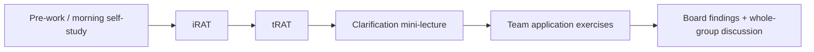

# Purpose of this document

This plan describes how to **design, build, and deliver** two days of sessions on principles and workflows for reproducible science as part of the doctoral course [K9F5740 *Quality Assurance in Research From a Global Perspective*](https://doctoralcourses.application.ki.se/fubasextern/info?kurs=K9F5740).

::: {.callout-note}
The agreed scope — purpose, learning outcomes, and what happens each day — is locked in [`session-brief.qmd`](session-brief.qmd). This plan is the working detail behind it; if the two disagree, the brief wins and this plan is corrected.
:::

It is a working plan for a **small teaching team (four people)** building the first offering in **under two weeks**: what to align to, which resources to reuse, which KI tools to use, how AI enters the workflow, and a short must-ship backlog.

Project-wide design and tooling choices are recorded in [`DECISIONS.md`](../DECISIONS.md).

## Shared endpoint (success criterion)

By the end of the two days, each student (or team) can:

> Create a **project folder structure** and **documentation** — independent of study methodology — so that they or someone else can return within **five years** and understand what was done and which decisions were made.

**Assignment link:** by the end of these two days, students should have the **practical knowledge and skills** to draft the **six SRC areas** locked in the brief (D023): documentation, data description, data quality, storage, security, and who is responsible.

This endpoint is the constructive-alignment anchor for session learning outcomes, self-study tasks, TBL application exercises, and any formative checks.

# Course context and outcome alignment

## Host course snapshot

| Item | Detail |
|------|--------|
| Course | K9F5740 Quality Assurance in Research From a Global Perspective (3 HEC) |
| Department | Global Public Health |
| Study period (HT 2026) | 2026-09-21 – 2026-10-02 |
| Course forms of teaching | e-(self)learning / flipped classroom; group work; presentations; discussion |
| Course assessment | **Data management plan (DMP)** using the Swedish Research Council template **and** a **data collection protocol**, based on the student’s PhD project |
| Prerequisites | GDPR + documentation/handling of research data (KI doctoral introduction) |

These sessions occupy **two consecutive days** (Tuesday–Wednesday). Afternoons are Team-Based Learning; venues differ by day:

| Block | Time | Day 1 | Day 2 |
|-------|------|-------|-------|
| Morning | 09:00–12:00 | Self-study (guided) | Self-study (guided) |
| Afternoon | 13:00–16:00 | **Hybrid:** room **Future** + [Zoom](https://ki-se.zoom.us/j/68142022512) | **Online only:** same [Zoom](https://ki-se.zoom.us/j/68142022512) |

**Compulsory components:** none for these two days (no session-level attendance gate or compensation rules beyond the host course’s own assessment of the DMP).

## Session learning outcomes (proposed)

The **locked** set is the five outcomes in [`session-brief.qmd`](session-brief.qmd), led by an explain-the-definition outcome (D025). The list below holds the longer working formulations they were consolidated from; keep it for mapping detail, not as a competing list.

At the end of these sessions, the student is expected to be able to:

1. **Explain** one established definition of reproducible research (Turing Way), note where definitions diverge (including qualitative auditability), and relate that to KI’s research and documentation guidelines.
2. **Use** version control (or an equivalent decision log) to track, organise, and document changes in a research project.
3. **Structure** a reproducible research workflow, including a durable folder layout and documented analytical / data-processing decisions.
4. **Collaborate** on code and research materials through an online repository (or shared documentation space) following open and reproducible science principles, at a level appropriate to the project’s sensitivity.
5. **Assess** ethical and practical implications of open research practices and reproducible workflows (what can be shared, what must stay protected, and how documentation supports accountability).
6. **Use generative AI tools responsibly** (preferring KI-supported tools) to draft folder structures, README content, decision logs, and documentation — while critically verifying outputs and recording how AI was used.
7. **Draft** answers for the six SRC DMP areas locked in the brief: documentation, data description, data quality, storage, security, and who is responsible.

## Mapping: session learning outcomes ↔ relevant K9F5740 course learning outcomes

Not every course learning outcome is in scope. The table below marks **relevance** and the **contribution** of these sessions.

| K9F5740 learning outcome (from syllabus) | Domain | Relevance | How these sessions contribute |
|-----------------------------|--------|-----------|-------------------------------|
| Understand Helsinki Declaration, GCP, GDPR, and key ethical milestones | Knowledge | Contextual | Ethical framing for what *must* be documented and what must *not* be put in public repos or AI prompts |
| Contrast collaboration / data-sharing agreements, MoUs, ALLEA Code of Conduct, Swedish/EU/international rules | Knowledge | Supporting | Documentation of agreements, roles, and data-sharing decisions in project docs / DMP excerpts |
| **Appreciate and justify procedures to collect and document data throughout all stages** (safety, quality, storage, transfer) | Knowledge | **Core** | Folder structure, README, decision log, data dictionary stubs, storage notes — the “5-year future self” test |
| Appreciate responsibilities of investigator, team, sponsor during data collection | Skills | Supporting | Roles section in project documentation; team TBL exercise on who owns which materials |
| **Develop protocols and comprehensive data management plans**, risk–benefit and project risk assessments | Skills | **Core** | Practical drafts that feed the course DMP (SRC template): the six areas in the brief |
| Develop data collection tools / question drafting | Skills | Low | Out of scope except documenting *where* instruments and versions live |
| Summarise management aspects for ethical, safety, and collaboration standards | Skills | Supporting | Project management via repo hygiene, issue/decision tracking, and handover docs |
| **Create data quality assurance plans** including consent, data safety, and **research documentation** | Skills | **Core** | Documentation conventions, naming, versioning, separation of raw vs derived data |
| **Judge project proposals and research documentation** re: data quality, safety, ethics, inclusion | Judgement | **Core** | Peer critique of another team’s folder + docs (TBL application) |
| Define and assess challenges, risks, and ethical concerns | Judgement | Supporting | Case-based risks of “undocumented projects,” AI leakage of personal data, premature open sharing |

### Alignment to the course assignment

The course assignment has **two** components:

1. **Data management plan (DMP)** — complete [`Swedish_Research_Council_Template__v5.docx`](../Swedish_Research_Council_Template__v5.docx) (Swedish Research Council / VR template used via DMPonline).
2. **Data collection protocol** — detailed planning for how data collection will run (timelines, quality, project management).

**These sessions are primarily a DMP workshop.** Confirmed with the course director (issue #6): students leave with the practical knowledge and skills to fill the **relevant** SRC DMP sections. There is **no hand-in to the session team** (D022); the host course still owns the DMP assignment. The shared endpoint (folder + documentation) is the practical substrate for writing a credible DMP. The data collection protocol is acknowledged and lightly supported (e.g. where instruments/versions live; quality checks), but is **not** the main focus of the two days — other course elements cover collection/project-management depth.

Students use **their own PhD project** (forward-looking or reflective). Session tasks ask them to work on *their* data and documentation (D027).

#### Session → SRC DMP map (use in class)

Template: [`Swedish_Research_Council_Template__v5.docx`](../Swedish_Research_Council_Template__v5.docx) (same as DMPonline). Only the **six areas in the brief** (D023). Other SRC questions are for the course assignment, not these two days.

**How to use after each major activity**

1. Update the **project package** (folder + README + decision log, etc.).
2. Open the SRC template (Word or DMPonline).
3. Paste or adapt today’s text under the **exact template question** below. Mark it as *draft*.

| When | Area | SRC template question | Tip |
|------|------|-------------------------|-----|
| Day 1 | Data description | *How will data be collected, created or reused?* | Provenance: how data exist and how that trail is recorded. |
| Day 1 | Data description | *What types of data will be created and/or collected, in terms of data format and amount/volume of data?* | Formats, rough volume, folder layout, naming. Prefer open formats when you can. |
| Day 1 | Documentation | *How will the material be documented and described, with associated metadata relating to structure, standards and format for descriptions of the content, collection method, etc.?* | README, decision log, data dictionary, folder conventions, versioning. Strongest fit with these sessions. |
| Day 2 | Data quality | *How will data quality be safeguarded and documented (for example repeated measurements, validation of data input, etc.)?* | Documentation and handling checks here; field/collection QC belongs in the **protocol**. |
| Day 2 | Storage | *How is storage and backup of data and metadata safeguarded during the research process?* | KI-approved storage; raw vs derived folders; not USB or personal Drive. |
| Day 2 | Security | *How is data security and controlled access to data safeguarded, in relation to the handling of sensitive data and personal data, for example?* | Who can access what; what must not go in public GitHub or AI prompts. |
| Day 2 | Who is responsible | *Who is responsible for data management and (possibly) supports the work with this while the research project is in progress? Who is responsible for data management, ongoing management and long-term storage after the research project has ended?* | Name people where you can. |

**What these sessions do *not* replace:** the **data collection protocol**, and the other SRC questions (legal, ethics, accessibility, long-term storage, software, DOI, costs). Here we only note where instruments and versions live.

#### Design implication (make sessions assignment-ready)

Every major activity should end with an explicit **“paste into your DMP”** step using the map above. By the end of Day 2, students should have a project package **plus** draft text under those six areas, for the course assignment — not a hand-in to the session team (D022).

# Pedagogical approach

## KI pedagogical policy (design principles)

Sessions should enact KI’s three pedagogical perspectives ([KI Pedagogical policy](https://staff.ki.se/education-support/organisation-of-higher-education-at-ki/kis-pedagogical-policy)):

| Perspective | Implication for these sessions |
|-------------|--------------------------------|
| **Student-centred and active learning** | Teachers facilitate; students build *their* project structure. Minimal lecturing; maximum doing and peer teaching. |
| **Scholarship of teaching and learning** | Collect feedback after each afternoon; revise materials between offerings; document what worked. |
| **Psychological safety** | Normalise incomplete projects and “messy first drafts.” Frame AI mistakes and Git confusion as expected learning, not failure. |

Constructive alignment (Biggs): **Learning outcomes → learning activities → assessment evidence** must stay coherent. The visible evidence here is the **project package** (folder + documentation) **and draft SRC DMP sections**, plus reflection on AI use — materials students can transfer into the course assignment.

## Team-Based Learning (TBL)

Intended model for afternoon blocks, consistent with KI practice and the course’s flipped design:

| TBL element | Day 1 focus | Day 2 focus |
|-------------|-------------|-------------|
| Pre-work | Definition + caveats; KI rules; **AI rules (Copilot-first)**; read GEP **Introduction**, **Data Management** 1–6, **Project Organization**, **Collaboration** 1; FAIR videos | Read GEP **Keeping Track of Changes**, **Data Management** 7, **Collaboration** 2–5 (versioning + sharing); prepare own package for afternoon exercises |
| iRAT / tRAT | Concepts: raw vs derived; README; decision log; FAIR vs open; what belongs in ELN vs project folder — item bank in [`tbl/day-1-irat.md`](../tbl/day-1-irat.md) | Versioning; collaboration; AI disclosure; ethical sharing boundaries — item bank in [`tbl/day-2-irat.md`](../tbl/day-2-irat.md) |
| Application | **Application 1:** unlabelled folder critique with the **full** 5-year rubric → team posts **2–3 findings** → whole-group discussion. **Application 2:** own folder + README; paste **data description** / **documentation**; light within-team check → **2–3 findings** → whole-group discussion | **Application 1:** alone → team → **2–3 findings** (tensions OK) → whole-group discussion; paste **storage** / **security**. **Application 2:** own package + AI docs; paste **data quality** / **who is responsible**; full within-team rubric → **2–3 findings** → whole-group discussion |
| Closure | Whole-group discussion of Application 1 and Application 2 board posts; common pitfalls; revisit Session → DMP map (in this plan) | Whole-group discussion of Application 1 and Application 2 board posts; peer-critique themes; handover checklist; partial DMP for the assignment |

**Psychological safety note:** keep readiness tests short and conceptual. Do not imply that students without Git are behind. Shared Office Online + §6.1-named backups, or dated copies + a decision log, meet the endpoint (D034). The decision log is a **human- and machine-readable** record so collaborators (people or tools) can get up to speed on project decisions.

# Teaching with AI (required design element)

Sessions must **incorporate AI tools to reach the endpoint** (folder + documentation), not treat AI as an optional aside.

## KI stance and preferred tools

Per [KI Generative AI and Education](https://staff.ki.se/tools-and-support/ai-at-ki/generative-ai-and-education) guidance:

- Prefer **Microsoft Copilot** (available to KI staff; students via KI licensing where applicable) for teaching demos and student drafting when institutional data protection matters.
- Teach **prompting, verification, transparency, and data safety** explicitly.
- Never paste personal data, patient data, or unpublished sensitive research into consumer AI tools.
- Require students to **document AI use** (tool, purpose, prompt summary, what was kept/changed).

Related KI learning resource: [*Working with (generative) AI*](https://ki.eu-west.catalog.canvaslms.com/courses/working-with-generative-ai) (Canvas Catalog).

## AI tasks tied to the endpoint

| Student task | AI role | Human responsibility |
|--------------|---------|----------------------|
| Propose folder tree for their study type (survey / qualitative / trial / secondary data) | Generate draft structure + naming conventions | Adapt to KI storage rules; remove unsafe suggestions |
| Draft README / project overview | Draft sections from a structured prompt | Verify accuracy; add real methods, dates, roles |
| Decision log / changelog entries | Turn rough notes into clear decision records | Confirm dates, rationale, and ownership |
| Data dictionary stub | Suggest variable documentation templates | Align with actual instruments; check identifiers |
| Critique a peer package | Suggest review questions against rubric | Make the judgement; do not outsource grading ethics |
| DMP draft (SRC template) | Turn README / folder notes into answers under the six SRC areas in the brief | Verify facts; no sensitive detail in prompts; mark text as draft for the assignment |

**Assessment of AI literacy (formative):** short reflection (½–1 page or structured form): what AI produced, what was wrong or unsafe, what was kept, and why.

# KI tools and systems to use

## Learning delivery

| Tool | Role in these sessions | Action needed |
|------|------------------------|---------------|
| **Canvas** | Course room: self-study modules, readings, AI-use disclosure form | Create module(s); publish schedule; link chosen TBL tool |
| **TBL platform** (see below) | Digital TBL: iRAT, tRAT, application exercises | Pick the simplest path that works for *this* run; keep content tool-agnostic |
| **Padlet** (optional) | Gallery walk of folder trees / README excerpts | Create board; privacy settings appropriate to class |
| **Zoom** | Hybrid Day 1 + remote Day 2 afternoons | Link: <https://ki-se.zoom.us/j/68142022512>; Day 1 also in room **Future** |

## TBL software options (KI-supported and open source)

We will likely need **open-source TBL software** in addition to — or instead of — KI’s licensed InteDashboard, for portability, transparency, offline/partner-site delivery, and alignment with the open/reproducible ethos of these sessions.

| Option | Licence / status | TBL coverage | Fit for these sessions | Caveats |
|--------|------------------|--------------|------------------------|---------|
| **InteDashboard** ([KI](https://staff.ki.se/tools-and-support/tools/intedashboard)) | KI institutional licence; Canvas-integrated | Full TBL workflow (iRAT, tRAT, AE, peer eval) | Lowest friction *inside* KI Canvas courses | Tied to KI; less reusable for multi-country partners; not open source |
| **LAMS** ([lamsfoundation/lams](https://github.com/lamsfoundation/lams), GPL-2.0) | Mature open-source learning-design platform | Dedicated [TBL wizard](https://docs.lamsfoundation.org/tbl) (teams, iRAT, tRAT, IF-AT-style feedback, application exercises) | **Primary open-source candidate** for a full digital TBL sequence | Needs hosting (self-host or LAMS cloud); teacher onboarding; check KI IT/GDPR if student accounts leave Canvas |
| **gRATify** ([gtheilman/gRATify](https://github.com/gtheilman/gRATify)) | Open source; Docker-friendly | Strong **tRAT / gRAT** with immediate feedback and live team progress | Good lightweight piece if RATs are the bottleneck | Not a full TBL suite (pair with Canvas quizzes for iRAT + Padlet/docs for AE) |
| **OpenTBL** ([opentbl.com](http://www.opentbl.com/) / [sixthedge](https://github.com/sixthedge/opentbl)) | Marketed as open source | iRAT/tRAT, peer eval, application exercises | Conceptually close to InteDashboard | Project appears **stale** (registration closed; sparse recent maintenance) — evaluate carefully before depending on it |
| **tbltools** (R, [KopfLab/tbltools](https://github.com/KopfLab/tbltools/)) | GPL-2.0 | Generate paper/IF-AT style RAT materials from question banks | Useful for **authoring** RATs and hybrid paper+digital rooms | Not a live classroom platform |
| **Canvas-native fallback** | KI Canvas + optional Padlet | iRAT via Canvas Quiz; tRAT via group quiz / scratch-off analogue; AE via shared board + peer critique | Always available; no new infra | Weaker IF-AT UX; more manual facilitation; AEs are not classic simultaneous report (D030) |

### Recommendation for this build (under two weeks)

1. **Write TBL content once** in Markdown/CSV in this repo (tool-agnostic).
2. **For the first run, prefer low friction:** InteDashboard if access is already available, otherwise **Canvas quizzes** for iRAT/tRAT. Application exercises use a shared board (Padlet) for Application 1 posts and **peer critique** for own-project work — not classic simultaneous report (D030). Do not block the offering on standing up new hosting.
3. Treat **LAMS / gRATify** as a follow-up experiment after the first offering works — unless someone on the team already has a working instance.
4. Log the choice for this run in `DECISIONS.md`.

## Research practice tools students should meet

| Tool | Role | Notes |
|------|------|-------|
| **KI ELN** | Mandatory electronic research documentation at KI | Position clearly: ELN = institutional research log; project folder/repo = analytical/organisational companion — they complement, not replace |
| **DMPonline (KI)** | Data management plans (SRC / VR template) | Students complete the course DMP here or via the Word template; sessions feed text into these sections |
| **SRC DMP template** ([`Swedish_Research_Council_Template__v5.docx`](../Swedish_Research_Council_Template__v5.docx)) | Course assignment form | Bring into Canvas; use as the checklist for “paste into your DMP” moments |
| **Approved storage** | Active data storage per KI lists | Teach “do not use USB / personal Drive for research data” |
| **Git + GitHub** (or GitLab) | Version control & collaboration | Optional if already used; not taught here (K8F6106) |
| **Office Online on Teams/SharePoint** | Preferred shared master for collaborative documents (GEP Single Master Online; D034 / D035) | Regular downloads into the project folder; name exports per KI §6.1. Google Docs / personal OneDrive OK for shared text if preferred |
| **Decision log (dated)** | Human- and machine-readable record of project decisions | Required in every project, whatever keeps the file history (D032) |
| **RStudio / Positron / VS Code** | Optional IDE demos | Do **not** require programming fluency; these sessions emphasise structure & documentation over coding |
| **Microsoft Copilot** | AI drafting assistant | Default institutional AI tool for demos |
| **Quarto / Markdown** | Lightweight documentation format for README and reports | Teach enough Markdown to maintain a README |

## Tools the *teaching team* needs (keep light)

| Need | Use |
|------|-----|
| Writing materials | Quarto/Markdown + Canvas pages; short slide deck only where useful |
| TBL items | Markdown/CSV in this repo → InteDashboard or Canvas quizzes |
| Examples | One good + one poor synthetic project folder |
| Shared work | This GitHub repo; decisions in `DECISIONS.md` |
| AI demo | Microsoft Copilot on the teacher machine |

# Review of available resources (reuse before reinventing)

## At KI (align, cite, avoid duplication)

| Resource | What it offers | How we use it |
|----------|----------------|---------------|
| [K8F6106 Open Science in Practice: Collaborative Research with Git](https://doctoralcourses.application.ki.se/fubasextern/info?kurs=K8F6106) ([materials](https://github.com/k-CIR/course-open-science-in-practice)) | Deep Git/GitHub/Quarto/R–Python workflow course | **Do not duplicate.** Signpost for students who need deeper skills; borrow *ideas* for folder/README examples with attribution |
| [K8F6069 Open Science and Reproducible Research](https://doctoralcourses.application.ki.se/fubasextern/info?kurs=K8F6069) | Concepts, incentives, transparency, metascience | Optional pre-reading pointers; keep our sessions practice-first |
| [KI Guidelines for research documentation and data management](https://staff.ki.se/research-support/research-data-management/plan-your-research-data-management/guidelines-for-research-documentation-and-data-management) | Institutional rules (ELN, DMP, FAIR, retention ≥10 years, naming) | **Core normative reading** for morning Day 1 |
| KI ELN documentation | How KI expects electronic documentation | Short demo or screencast; clarify boundary with project folders |
| Research Data Office (`rdo@ki.se`) | Expert support | Invite a 20–30 min guest slot or office-hours link |
| UoL generative AI pages + Canvas AI course | Pedagogy and safe AI use | Teacher prep + student AI module |

## External open educational resources

| Resource | Use |
|----------|-----|
| [Wilson et al., *Good Enough Practices in Scientific Computing*](https://doi.org/10.1371/journal.pcbi.1005510) / [Carpentries adaptation](https://carpentries-lab.github.io/good-enough-practices/aio.html) | Primary pedagogical source for folder layouts (`data/`, `doc/`, `results/`, `src/`) and naming |
| [The Turing Way](https://book.the-turing-way.org/) — project design, research compendia, VCS, documentation | Selective chapters as self-study; avoid overwhelming breadth |
| [NBIS Tools for Reproducible Research](https://nbis.se/training/tools-for-reproducible-research) | Advanced (Conda, Snakemake, containers) — **signpost only**, out of scope for two days |
| Software/Data Carpentry Git lessons | Optional deep dive links for motivated students |
| *Field Trials of Health Interventions: A Toolbox* (course literature) | Tie documentation examples to global health field-trial realities |

### Pre-reading split: Good Enough Practices across the two days

Good Enough Practices has **no Part A / Part B** in the source. We assign **named sections** of [Wilson et al. (2017)](https://doi.org/10.1371/journal.pcbi.1005510) across the two mornings (D021 section cut; D039 drops the invented part labels). The brief lists the same sections; this section is the cut rationale and the KI corrections. The [Carpentries adaptation](https://carpentries-lab.github.io/good-enough-practices/aio.html) is the easier student-facing link.

**Before Day 1 — *keep it, and describe it*** (transparency and provenance; ~25–30 min)

| Reading section | Principle it carries into Day 1 |
|-----------------|----------------------------------|
| Introduction, including the shared principles (planning, modular organisation, names, documentation) | Frames the whole reading; gives students the vocabulary the readiness test uses |
| **Data Management**, recommendations 1–6 (save the raw data; back it up in more than one location; create the data you wish to see; create analysis-friendly data; record all the steps used to process data; use multiple tables and a unique identifier per record) | Raw versus derived, and provenance of every processing step — the core Day 1 distinction |
| **Project Organization**, all recommendations (`data/`, `doc/`, `results/`, `src/`, `bin/`; naming files for content and function) | The folder layout students build in the Day 1 application exercise |
| **Collaboration**, recommendation 1 only (create an overview of your project — the README) | The README they write in the same exercise; “future self is a collaborator” |
| *Carpentries only:* the short **Data management plans** block at the end of the Data Management episode | Connects the morning's SRC template skim to the reading |

**Before Day 2 — *track it, share it, credit it*** (openness with boundaries and accountability; ~25–30 min)

| Reading section | Principle it carries into Day 2 |
|-----------------|----------------------------------|
| **Keeping Track of Changes**, all recommendations, including the manual versioning procedure (dated `CHANGELOG`, dated copies), version control systems, what not to put under version control, and inadvertent sharing | Readable history; GEP also endorses Single Master Online (Manuscripts) — at KI that means **Office Online** on Teams/SharePoint + §6.1 naming on exports (D034) |
| **Data Management**, recommendation 7 (submit data to a reputable DOI-issuing repository), including metadata written for humans versus for harvesters | Findability and credit; “as open as possible, as closed as necessary” |
| **Collaboration**, recommendations 2–5 (shared to-do list; communication strategies; make the license explicit; make the project citable), plus the Carpentries block on collaborating with sensitive data | Accountability to other people: who may reuse this, on what terms, and how they cite it |
| **Software** and **Manuscripts** — *optional skim, signposted only* | Out of scope (see the brief); offered to students who write code or want the text-based manuscript workflow |

**Why this cut and not another**

- The split falls between **recommendation 6 and 7 of Data Management**: everything up to 6 is about keeping and describing material you already hold (Day 1); 7 is about releasing it to strangers (Day 2).
- **Collaboration** is the one section deliberately split. Its README recommendation is the Day 1 deliverable, while licensing, citation, and communication only become decidable once students have something worth sharing.
- **Keeping Track of Changes** stays whole on Day 2 (D021). Point students to GEP’s **Single Master Online** and implement it with **Office Online** + KI §6.1 naming (D034); dated copies remain the non-online fallback.
- Each day's section list is short enough to leave the morning's remaining time for the AI task and the students' own project, which is where the self-study hours are actually spent.

**Where the reading needs a KI correction** (say this in the Canvas reading note, not only in class)

| Reading says | What students follow instead |
|--------------|------------------------------|
| Commercial cloud storage (S3, Dropbox and similar) is a reasonable backup or mirror | KI-approved storage for research data; no personal cloud accounts, no USB drives |
| Back up (almost) everything created by a human, mirrored off the working machine | Same rule, inside approved storage — and personal or sensitive data never goes to a public repository or an AI prompt |
| Choose CC-0 / CC-BY for data and a permissive licence for code | Licensing applies to what may legally be shared; consent, ethics approval, and GDPR decide that first |
| Single Master Online via Google Docs or MS OneDrive | **Prefer** Office Online on KI Teams/SharePoint; Google Docs / personal OneDrive remain fine for shared **text**. Name downloads per KI §6.1 (D034 / D035). Restricted research data still follows the approved-storage row above |

## Positioning statement (for syllabus text / Canvas)

> These sessions start from **The Turing Way’s definition of reproducible research** (same data and same analysis), note where definitions diverge (including qualitative auditability), and point to KI’s documentation and openness requirements. They then run a **hands-on DMP workshop** inside K9F5740: students organise a project folder and write documentation for their own PhD work, then transfer that text into the **Swedish Research Council DMP template** (assignment component 1). The data collection protocol (assignment component 2) is supported only lightly here. Programming is helpful but not required; responsible use of KI-supported AI tools is part of the workflow.

# Proposed two-day blueprint

## Day 1 — Definition, then structure and documentation

**Venue (afternoon):** room **Future** + [Zoom](https://ki-se.zoom.us/j/68142022512) (hybrid).

**Morning self-study (3 h)**

1. Orientation: Turing Way definition + caveats; KI passages on *reproducera* / reproducibility; **course DMP assignment**; schedule.
2. **AI rules before Application 2:** Copilot-first; no sensitive data in prompts; keep prompt + output; verify; disclose ([KI Generative AI and Education](https://staff.ki.se/tools-and-support/ai-at-ki/generative-ai-and-education); full package #15).
3. Skim the [SRC DMP template](../Swedish_Research_Council_Template__v5.docx) headings + the **Session → SRC DMP map** in this plan (the six areas in the brief).
4. Read: Good Enough Practices **Introduction**; **Data Management** 1–6; **Project Organization**; **Collaboration** 1 — and the KI guidelines named in the brief ([Riktlinjer för forskning](https://medarbetare.ki.se/media/99275/download) §§6–7; documentation and data management guidelines).
5. FAIR: How to FAIR videos + KI FAIR-principles page (URLs in the brief).
6. Individual readiness notes for iRAT.

**Afternoon TBL (3 h)**

1. iRAT / tRAT on core concepts (definition vs KI aims; raw vs derived; FAIR vs open; ELN vs folder).
2. Clarification from tRAT splits.
3. Application 1: compare two synthetic project folders (unlabelled) using the **full** 5-year rubric as a guide — each team posts **2–3 findings** (folder + question); whole-group discussion of the board (D049).
4. Application 2: create folder + README for *your* PhD project (manual or Copilot under morning AI rules); paste **data description** (both SRC prompts) and **documentation** into the DMP.
5. Within-team light check, then team posts **2–3 findings**; whole-group discussion. Full rubric walk waits for Day 2 (D048 / D049).
6. Closing note: one improvement before Day 2 + how it supports reproducibility or auditability.

## Day 2 — Versioning, sharing, and the DMP

**Venue (afternoon):** [Zoom only](https://ki-se.zoom.us/j/68142022512) (no on-site room).

**Morning self-study (3 h)**

1. Read: Good Enough Practices **Keeping Track of Changes**; **Data Management** 7; **Collaboration** 2–5 — and the Day 2 readings named in the brief (KI share/collaborate + open-access policy; metadata vs raw data). No separate versioning mini-lesson (D031).
2. Skim the SRC questions for the four Day 2 DMP areas.
3. Prepare *your* PhD project package notes for afternoon applications (D036).

**Afternoon TBL (3 h)**

1. iRAT / tRAT: collaboration, AI disclosure, sharing boundaries, quality of documentation.
2. Application 1: alone → team → board (D044 / D049) — choose readable history + sharing/access limits for *your* project; paste **storage** and **security**; team posts **2–3 findings** (tensions OK); whole-group discussion.
3. Application 2: refine folder + README / decision log (manual or Copilot); paste **data quality** and **who is responsible**.
4. Within-team peer critique walks the **full** 5-year rubric (no pass/fail); team posts **2–3 findings**; whole-group discussion (D048 / D049).
5. Close: KI contacts; take-away checklist (package + **partial SRC DMP** + AI disclosure for the course assignment).

## 5-year rubric (draft criteria)

Student-facing copy: [`canvas/pages/five-year-rubric.md`](../canvas/pages/five-year-rubric.md). Use the **full** guide in Day 1 Application 1 and again in the Day 2 peer critique. Do not force a row-by-row walk in the exercises in between (D048). Discussion questions only; no pass/fail (D046).

| Criterion | Discussion question |
|-----------|---------------------|
| Orientability | From the README alone, what is this project, who is involved, and where do I start? |
| Separation of concerns | Which files are raw data, which are derived, and which are docs or procedures? |
| Decision traceability | Where would I find why a cleaning step, exclusion, or method choice was made? |
| Naming & versions | If I sort the folder by name, is the latest version obvious? |
| Ethics & access | What may be shared, what must stay protected, and where does the official record live (ELN/DMP)? |
| Handover readiness | Could a new colleague restart next week without calling you? |
| AI transparency | If AI was used, where is that disclosed, and what did a human change? |

# What to build (≈2 weeks, team of four)

Keep the backlog small. Aim for a **runnable first offering**, not a complete course platform. Park nice-to-haves for later.

Suggested split (adjust names as needed):

| Person | Focus |
|--------|--------|
| A | Scope lock with course director; Canvas shell; logistics |
| B | Day run sheets + TBL questions / application exercises |
| C | Example folders, templates, reading pack |
| D | AI prompts + disclosure; TBL tool choice / fallback |

## Must ship

Six tracked issues, one per material the first offering cannot run without (D019). Names in brackets are the facilitators named in [`session-brief.qmd`](session-brief.qmd).

- [x] Confirm dates, rooms, compulsory bits, and that these days are framed as **DMP workshop** (protocol = other course parts) — see D012–D015; DMP framing already in D010
- [ ] **#9** Run sheets for the four blocks: Day 1 opens with Turing Way definition + caveats + KI cites (D025); versioning is taught generically rather than as a Git lesson; each major activity ends with an explicit **“paste into SRC DMP”** step — *drafts in [`sessions/`](../sessions/)*
- [ ] **#10** Canvas module: **six** student pages (overview + Day 1/2 morning + Day 1/2 afternoon + 5-year rubric; D043), SRC template in Files, paste targets on each day page — *drafts in [`canvas/`](../canvas/); publishing to the course room still required (#17)*
- [ ] **#11** Materials pack: one good + one poor synthetic project folder [Johanna] (**Day 1 afternoon Application 1**, D029) — *live at [Drive Exercise 1](https://drive.google.com/drive/folders/1vQgA7VL_Bw2BN6U4PwI0Mk94ZPkJ2hpG); facilitator notes in [`sessions/day-1/exercise-1.md`](../sessions/day-1/exercise-1.md)* — plus README / decision-log / data-dictionary templates; **5-year rubric** student page shipped in [`canvas/pages/five-year-rubric.md`](../canvas/pages/five-year-rubric.md) (D043)
- [ ] **#13** TBL content: conceptual iRAT/tRAT banks for both days [Martin] plus the Day 1 and Day 2 application exercises (Markdown/CSV, tool-agnostic) — *iRAT/tRAT drafts from the reading in [`tbl/`](../tbl/); items on the KI guidelines, FAIR, and AI disclosure still missing; application exercises pending*
- [ ] **#15** AI package: student rules, prompts for Day 1 Application 2 and Day 2 Application 2 (README / decision log), a demo that includes one wrong answer, and the disclosure template — *Day 1 morning must already carry the Copilot-first / data-safety / disclose rules (D028) even if this package is incomplete*
- [ ] **#17** Delivery readiness: TBL delivery picked for this run and logged in `DECISIONS.md`, Canvas published, Day-0 smoke tests done

Session learning outcomes need no separate freeze — the five locked outcomes are in the brief.

## Explicitly defer

- Minute-level facilitator scripts and peer-evaluation systems  
- Multiple shared case vignettes for applications (students use their own PhD projects — D027)  
- Polished videos, SoTL instruments, multi-platform export guides  
- Full LAMS/gRATify production hosting (unless someone already has it running)  
- Guest RDO/ELN live demos (screenshots or a link is enough)

## Day-0 checklist

- [ ] Day 1: room **Future** + Zoom AV smoke-test; Day 2: Zoom-only ready; shared link <https://ki-se.zoom.us/j/68142022512>  
- [ ] Students know laptop expectation (hybrid/remote afternoons)  
- [ ] Canvas published; TBL tool smoke-tested once  
- [ ] Copilot (or agreed AI) available for the demo machine  

# Risks (keep in view)

| Risk | Mitigation |
|------|------------|
| Skill / method mix | Own PhD projects; prefer Office Online + §6.1 naming; teams help each other against the 5-year rubric |
| Overlap with K8F6106 | Signpost only; no deep Git/containers |
| AI data leakage | Copilot-first; no real personal data in prompts |
| “Open = public GitHub” | Ethics case in application exercise |
| TBL tool not ready | Default to Canvas quiz for iRAT/tRAT; Application reporting via Padlet/shared board + peer critique (D030) |
| Scope creep | Protect the folder + docs endpoint; stop when Must ship is done |

# References and links (quick list)

- Course page: <https://doctoralcourses.application.ki.se/fubasextern/info?kurs=K9F5740>
- Syllabus K9F5740 (Fubas): <https://fubasdoc.ki.se/fubas-filserver/pdf/FU-kurs/en/K9F5740>
- KI Pedagogical policy: <https://staff.ki.se/education-support/organisation-of-higher-education-at-ki/kis-pedagogical-policy>
- KI generative AI in education: <https://staff.ki.se/tools-and-support/ai-at-ki/generative-ai-and-education>
- InteDashboard at KI: <https://staff.ki.se/tools-and-support/tools/intedashboard>
- Digital systems for teaching: <https://staff.ki.se/tools-and-support/it-and-telephony/the-digitalisation-portfolio/digital-systems-for-teaching-and-learning>
- LAMS (open source) + TBL docs: <https://github.com/lamsfoundation/lams> · <https://docs.lamsfoundation.org/tbl>
- gRATify (open-source tRAT): <https://github.com/gtheilman/gRATify>
- OpenTBL (evaluate carefully): <http://www.opentbl.com/> · <https://github.com/sixthedge/opentbl>
- tbltools (RAT authoring in R): <https://github.com/KopfLab/tbltools/>
- Decision log for this project: [`DECISIONS.md`](../DECISIONS.md)
- KI research documentation & data management guidelines: <https://staff.ki.se/research-support/research-data-management/plan-your-research-data-management/guidelines-for-research-documentation-and-data-management>
- Good Enough Practices: <https://doi.org/10.1371/journal.pcbi.1005510>
- The Turing Way: <https://book.the-turing-way.org/>
- Related KI course K8F6106 materials: <https://github.com/k-CIR/course-open-science-in-practice>
